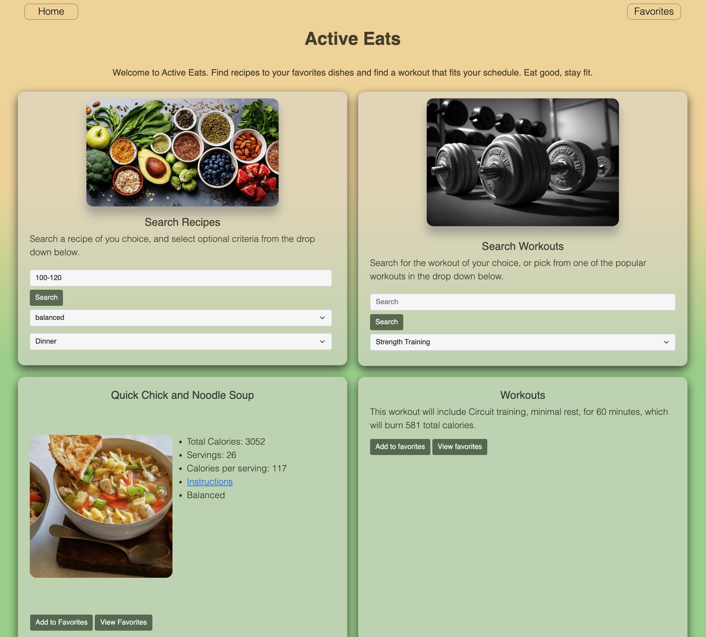
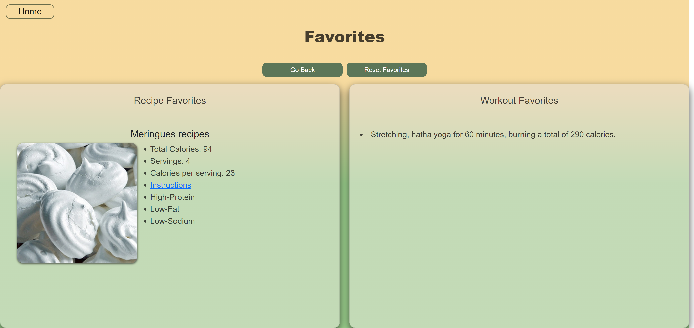

# Active Eats!

## Description
This application is intended for users who have been struggling with finding a diet to compliment there workout exercises. Users will have the ability to keep track of there calories and calories per serving as well as a quick exercise that can help you burn the amount of calories the user has just consumed. Users will be asked via a search bar to select a specific range of calories they would like to custom select what kind of diet they want and select the type of meal they would like. After selecting these parameters a recipe will be generated and displayed along with important information about the recipe that was just generated. You will also have the ability to either search for a specific exercise or choose from a few popular categories that we provide for you. You will then be provided instructions and important information for your workout exercise. After being provided with this information users will have the ability to save there favorite recipes and exercises with the Add to favorites button.You can access your favorites via the Favorites tab at the top right of the application.

 
# The Goal
The goal of this application is to provide users with a comprehesive list of excercises targeting every major muscle group.

As well as providing a full analysis of food receipes that compliment your choice of exercise.

Users that have a busy schedule can use this application to get ahead and pre plan there day and save time through out there busy schedule.

# User Story 
As an active person with a busy schedule

I want an application that can generate meals and a workout for me without losing any valuable time.

As a person having issues with finding a good diet

I want an application that is efficient and can provide me a solution for finding a diet that fits me.

# Deployed Link 
<a href="https://tamerbekir.github.io/active-eats/">Active Eats</a>

# Active Eats Repository
<a href="https://github.com/Tamerbekir/active-eats">Active Eats Repo</a>

# API Links
<a href="https://developer.edamam.com/edamam-nutrition-api">Edamam Nutrition API</a>
<a href="https://api-ninjas.com/api/exercises">Ninjas API</a>

# Image Credits

<a href="https://www.freepik.com/photos/gym-wallpaper">Gym</a>  
<a href="https://www.prevention.com/food-nutrition/healthy-eating/g33416014/heart-healthy-food-wd">Healthy Food</a> 
<a href="https://mainafinance.medium.com/unlock-your-full-potential-10-best-wheelchair-exercises-for-a-strong-and-fit-body-5b3608ad8654<">WheelChair Fitness</a> 
<a href="https://www.menshealth.com/fitness/a19530279/resistance-training-to-build-muscle/">Training</a> 
<a href="https://www.menshealth.com/uk/health/a39726399/cyclists-live-longer-study/">Cycling</a> 
<a href="https://www.pexels.com/search/yoga/">Yoga</a> 
<a href="https://www.menshealth.com/uk/fitness/a758565/this-20-minute-rowing-workout-strips-fat-and-builds-lean-muscle/">Rowing</a> 

# Screenshot

# Contributors
<a href="https://github.com/rafarizvi">Rafa Rizvi</a> 
<a href="https://github.com/Tamerbekir">Tamer Bekir</a> 
<a href="https://github.com/JaysonNunez1">Jayson Nunez</a> 

